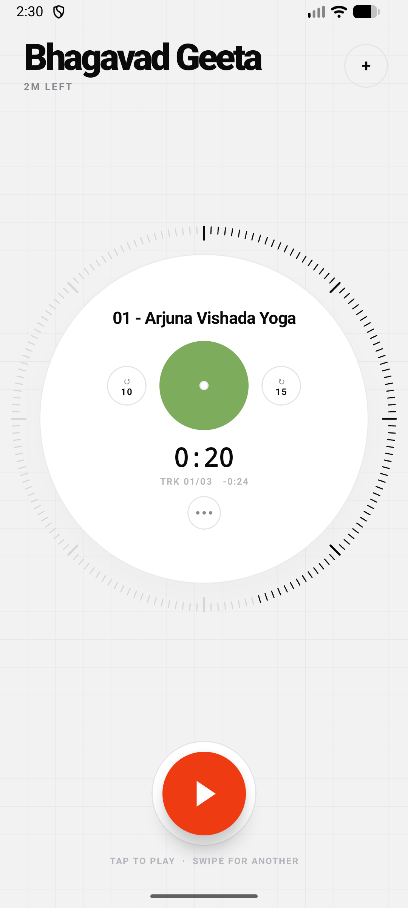
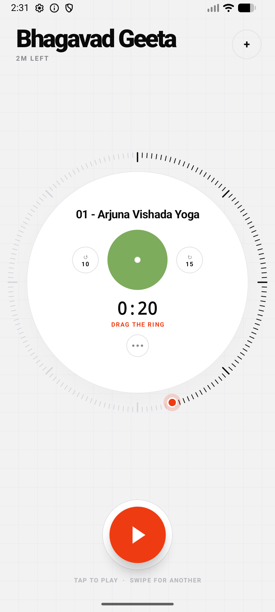
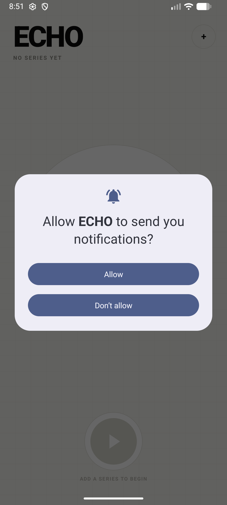

# ECHO

An offline audiobook player for Android that never loses your place.

Point it at a folder of audio files and it becomes a series you can listen to. One screen, one
button, and a resume point that survives reboots.

<p align="center">
  
  
  
</p>

## Why

Most audiobook apps want your account, your library, and a network connection. This one wants a
folder. It has no internet permission at all — not "offline mode", no networking code in the app.

The thing it takes seriously is the resume point. Losing your place in a 30-hour book is the one
failure that actually matters, so the position is written continuously and the app rewinds slightly
when you come back.

## Features

- **Folders become series.** Every audio file inside becomes a chapter, sorted by file name and
  numerically aware, so `Chapter 2` sorts before `Chapter 10`. Nested folders are included.
- **Resumes 15 seconds back.** The disc shows exactly where you stopped; pressing play starts 15
  seconds earlier so you catch the thread again. Deliberate moves — tapping a chapter, scrubbing
  the ring — are honoured exactly, with no rewind.
- **Survives everything.** Position is saved on a 5 second heartbeat while playing, and again on
  every pause, seek, chapter change, app swipe-away and service teardown. Verified against process
  kill, device reboot, and reboot with networking disabled.
- **Background playback** via a `MediaSessionService`, with notification and lock-screen controls,
  audio focus and headphone handling.
- **Your own cover art.** Pick a picture from the gallery; it becomes the record label on the disc
  and the artwork on every chapter, including the lock screen.
- **Name your series** and give it an author or narrator.
- Track list, playback speed 0.75×–2× per series, and a sleep timer (countdown or end-of-chapter).
- Follows the system light/dark theme.

## The interface

Each series is a disc, and the disc you are on names itself at the top of the screen. Swipe
vertically to move between series.

The tick ring around the disc is both the progress read-out and the scrubber — **but it will not
move until you tap it.** A tap arms it and shows the accent handle; it disarms itself after a few
seconds. Losing your place because a thumb brushed the edge is worse than one extra tap.

`−10s` and `+15s` sit either side of the cover. There are no next/previous chapter buttons; the
track list behind the `•••` does that job. One accent button at the bottom plays and pauses.

## Install

Download an APK from [Releases](../../releases), or build it yourself.

## Build

Requirements:

- **JDK 17 or newer.** The Android Gradle Plugin will not run on Java 8.
- Android SDK with platform **API 36**.
- A device or emulator running **Android 8.0 (API 26)** or newer.

```bash
git clone https://github.com/tejsav/echo-audiobook-player.git
cd echo-audiobook-player
./gradlew assembleDebug
```

The APK lands in `app/build/outputs/apk/debug/app-debug.apk`. Install it with:

```bash
adb install -r app/build/outputs/apk/debug/app-debug.apk
```

Create `local.properties` with your SDK location if Gradle cannot find it:

```properties
sdk.dir=/path/to/Android/Sdk
```

On Windows use `gradlew.bat` in place of `./gradlew`. If Gradle picks the wrong JVM, pass
`-Dorg.gradle.java.home="/path/to/jdk-17"`.

## How it is put together

Kotlin, Jetpack Compose, Media3/ExoPlayer, Room. No dependency injection framework and no
navigation library — the app is one screen.

| Layer | Where | Notes |
| --- | --- | --- |
| Playback | `playback/PlaybackService.kt` | `MediaSessionService` + ExoPlayer; the only writer of resume positions |
| Session bridge | `playback/PlayerConnection.kt` | `MediaController` mirrored into a `StateFlow`; owns the 15s pick-up rewind |
| Storage | `data/` | Room: `books` + `chapters` |
| Import | `data/BookImporter.kt` | Storage Access Framework tree walk, tag reading, natural-order sort |
| Covers | `data/CoverStore.kt` | Gallery pictures are copied into app storage and downscaled, never referenced by uri |
| Dial | `ui/dial/` | The disc, its tick ring and scrub gesture, and the accent button |
| Screen | `ui/deck/` | The carousel and the series sheet |

Four things worth knowing before changing the playback code:

- Media items carry `bookId|chapterIndex` as their media id, so the service can always work out
  what to save without holding separate state that could drift.
- Loading a queue reports its start position through the same callbacks a real move does.
  `PlaybackService` suppresses saves for a moment after a playlist change; without that, the 15s
  rewind would be saved back and walk the book backwards on every open.
- `books.currentChapterTitle` and `books.currentChapterDurationMs` are denormalised so the carousel
  can draw any disc from a single row instead of loading every series' chapters. They are kept in
  step by the same UPDATE that writes the resume point.
- The scrub ring only claims touches in the outer band, and only once armed, so a vertical swipe
  through the middle of the disc still pages to the next series.

## Known limits

- Covers are stored at up to 1024px on the long edge, re-encoded as JPEG.
- Importing a large series reads tags from every file, which takes a moment. There is a progress
  panel and it can be cancelled.
- Re-importing a folder refreshes its chapters but keeps your position, name and cover.
- Screenshots above show the light theme.

## Contributing

Issues and pull requests are welcome. There is no test suite yet; if you change playback or the
resume logic, please describe how you verified it — process kill and reboot are the cases that
matter.

## Licence

[MIT](LICENSE).
